# Weather Forecasting Using Deep Neural Network Techniques

### Software and Tools Requirements
1. [Github Account](https://www.github.com/AkhilHaldar)
2. [VS Code IDE](https://code.visualstudio.com/)
3. [Kaggle Notebooks](https://kaggle.com/AkhilHaldar)
4. [Git Cli](https://git-scm.com/downloads/)
### Frameworks & Libraries
- [TensorFlow](https://www.tensorflow.org/)
- [Keras](https://keras.io/)
- [Scikit-learn](https://scikit-learn.org/stable/)
- [Pandas](https://pandas.pydata.org/)
- [NumPy](https://numpy.org/)
- [Matplotlib](https://matplotlib.org/)
- [Seaborn](https://seaborn.pydata.org/)

## Running the Project

This project was developed and trained entirely on **[Kaggle Notebooks](https://www.kaggle.com/AkhilHaldar)**, so you don’t need to set up a local environment unless you want to run it offline.  

### Option 1: Run on Kaggle (Recommended ✅)
- Open the notebook (`.ipynb`) directly in Kaggle.
- All dependencies are pre-installed in Kaggle (TensorFlow, Keras, NumPy, etc.).

### Option 2: Run Locally (Optional 🖥️)
Create a new environment
```
python -m venv venv
```

Active the Environment
```
venv\Scripts\activate
```
Install Requirements
```
pip install -r requirements.txt
```


##                                   INTRODUCTION

      Weather forecasting predicts future atmospheric conditions like temperature, rainfall, and wind using data from sources like satellites and sensors. It is essential for agriculture, disaster management, and daily planning.
      [2] A Deep Neural Network (DNN) is a machine learning model with multiple layers of artificial neurons that learn hierarchical features from data. It captures complex patterns, making it suitable for tasks like image recognition, natural language processing, and forecasting.
      [5] DNNs improve weather forecasting by capturing complex, non-linear patterns that traditional methods struggle with. Using CNNs for extraction of spatial features and LSTMs for long term  dependencies between the data, DNNs offer more accurate predictions, handle real-time forecasting, and scale efficiently for various regions and variables.

##                                     Literature Review
        
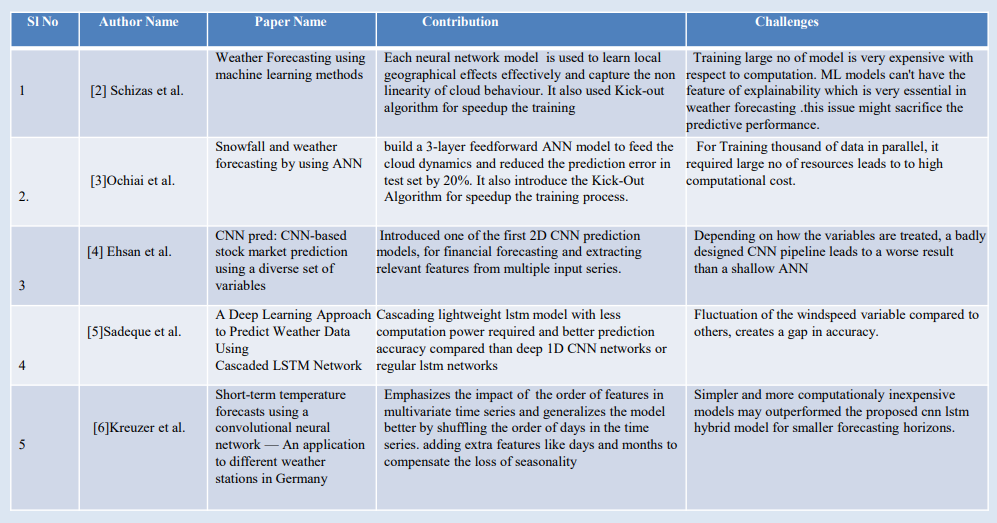

##                                      DATA SET

We used time series data of a city in Maharashtra called Nagpur. It's situated a landlocked
city without presence of nearby rivers in Central India. From the data pool, we get a set of
25 features, removing irrelevant features we get 15 features.
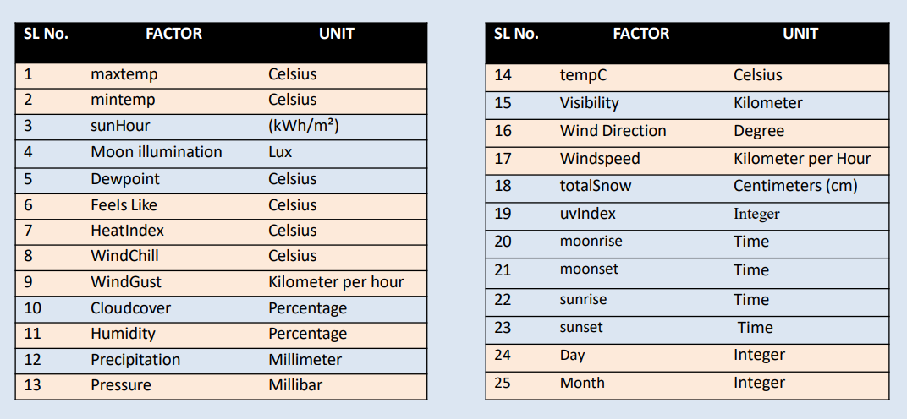


# Step By Step Project Development
### Step 1: Dataset Importing and Understanding.

We import the dataset “Historical Weather Data for Indian Cities”[1] which is publicly
available on Kaggle.


## Step 2: Dataset Splitting
We split the data into 3 seasons: Summer, Winter, and Monsoon.
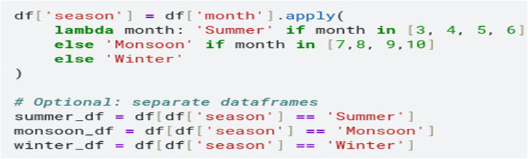

## Step 3: Training and Test Split
Divided the dataset into training and testing (80% Training,20% Testing)
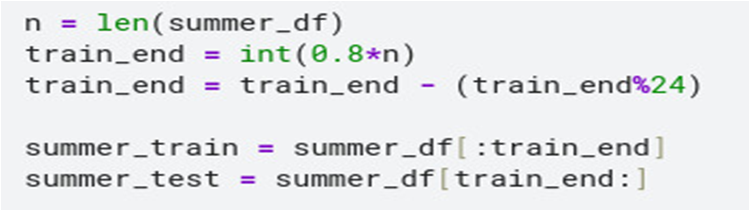

## Step 4: Scaling the Dataset
We used Min-Max Normalization to normalize all the features. 
  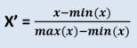 
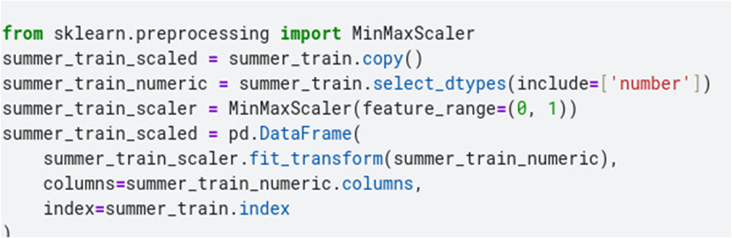

## Step 5: Grouping Data into a 24-hour Block
We created the blocks containing 24 hours
of data and appended them for each
iteration.
We created a specific date and time block
for the summer train dataset, which also
has 24 Timestamps.
We also created this matrix for all three
seasons.
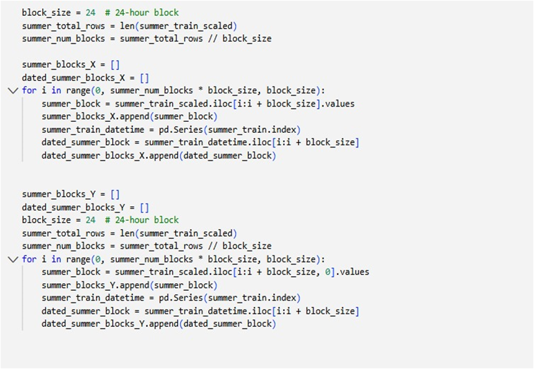

## Step 6: Creating Overlapping Windows
We created the overlapping windows of size 3 days as an input sequence. For each input sequence, we created a window of the next 1 day as an output sequence.
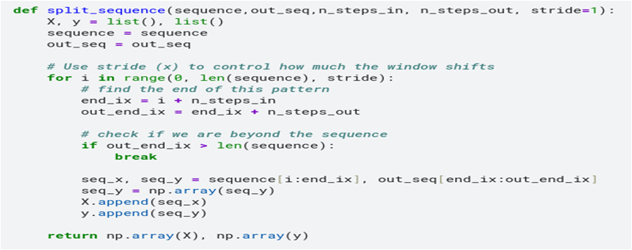

## Step 7: Preparing Model Input
We reshape our samples into a 72 X 15  matrix, which is fed to our model.
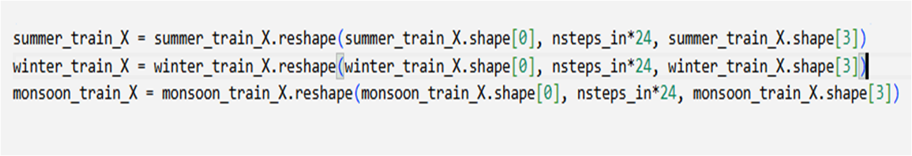

## Step 8: Model Building
We implemented a CNN-LSTM hybrid model where CNN was used for feature extraction and LSTM for capturing long-term dependencies between the data.
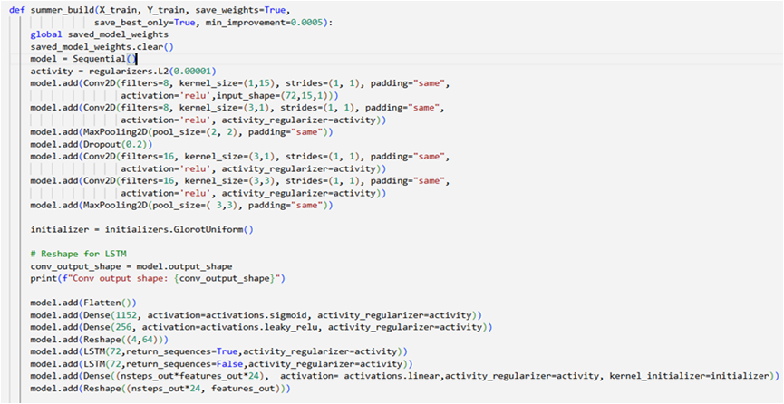
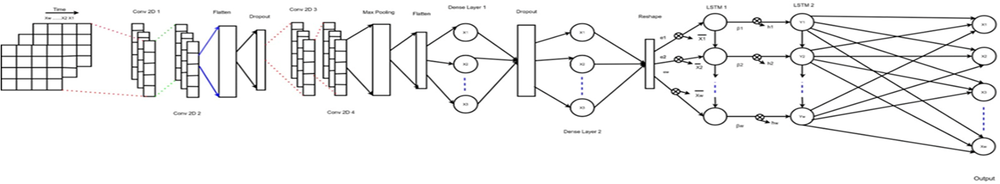

## Step 9: Model Compilation & Training
We trained the model for 800 epochs with a learning rate of 0.001. We used 10% of the training data for validation,
and also used the Adam optimizer to optimize the training process. The MSE (Mean Squared Error) loss function is
Used here. We set model checkpoints based on the decreasing RMSE value. At the end of training, we restore the
weights that resulted in the best combined RMSE value of the training and validation set.


## Step 10: Denormalization & Prediction
We predict labels from the test set and denormalize them to produce the final prediction.
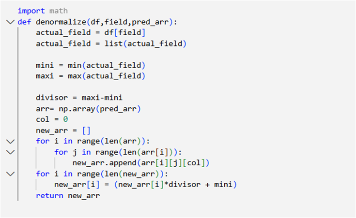


# Observed Output
We compare our proposed model with a baseline model consisting of dense neurons only. On comparison, we get the following matrix below
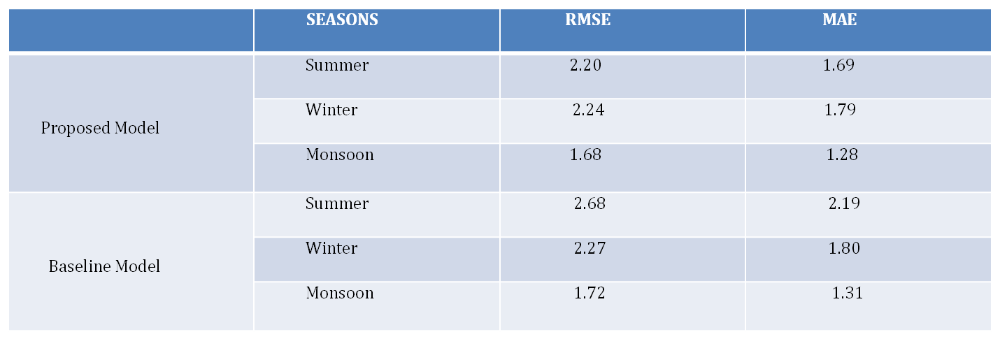

# Graph Of Predicted vs Actual Temperature of Summer:
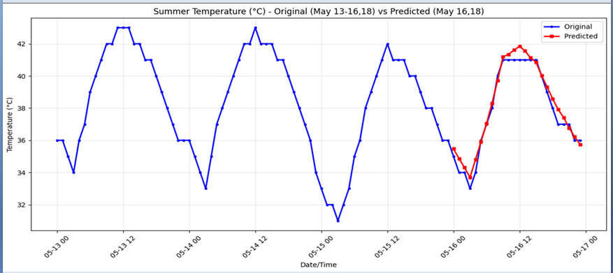
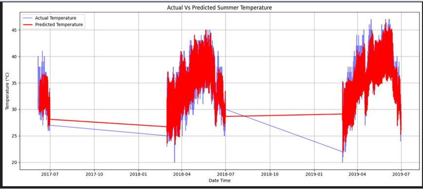

# Graph Of Predicted vs Actual Temperature of Monsoon:
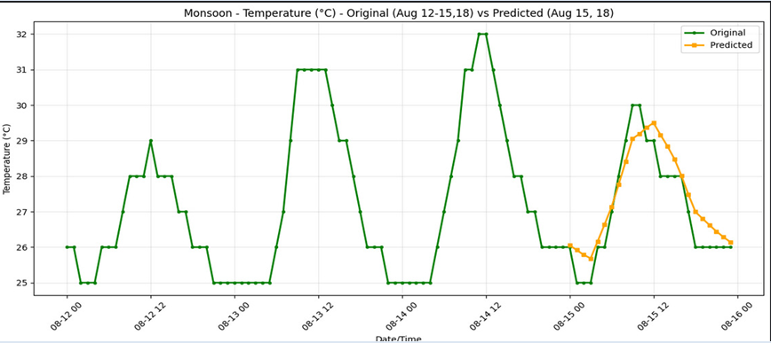
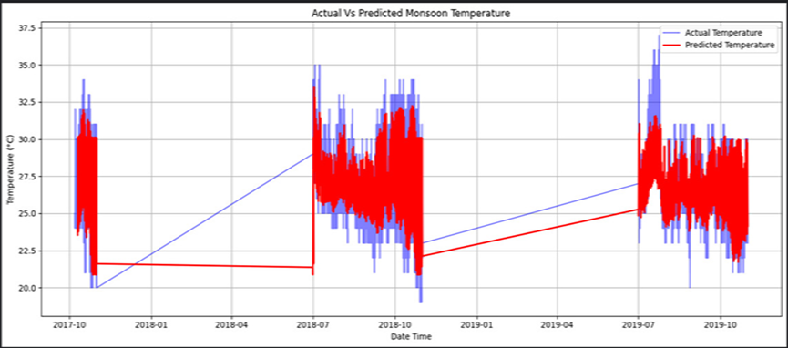

# Graph Of Actual Temperature vs Predicted Temperature of Winter
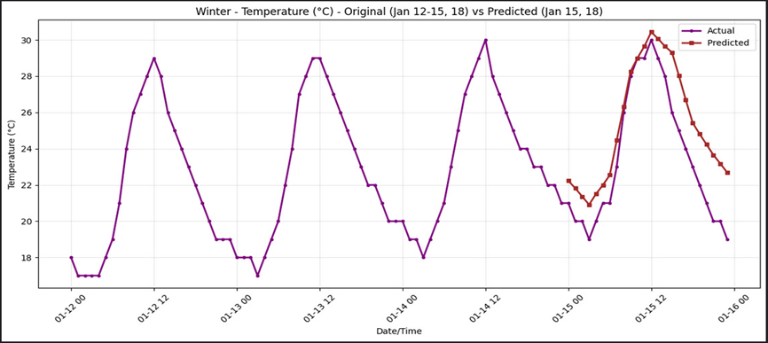
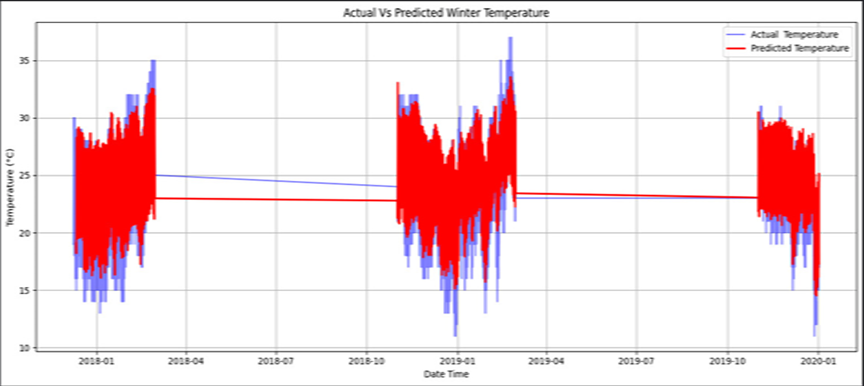

## Conclusion
The overall purpose of weather forecasting is to protect lives,  agriculture, disaster management, and make daily life easier. In our project, we successfully developed a weather forecasting model using a deep neural network, which is combines a CNN and an LSTM network. In this, we used 72-hour data to predict the next 24-hour temperature of India based city of Nagpur. By developing and training the model, we are able to capture both spatial and temporal patterns. We enhanced performance through proper data preprocessing, normalization, seasonal splitting, and hyperparameter tuning. The results, measured using MAE and RMSE, confirm that deep learning techniques offer a powerful and scalable solution for precise short-term weather forecasting. Following this model, we can also predict other weather components like humidity, windspeed, air pressure, precipitation etc. This project highlights the potential of deep neural networks and opens the door for future modernization of technology. This approach can assist in better planning and decision-making for weather-dependent activities.

## Acknowledgement
We acknowledge our overwhelming gratitude & immense respect to our revered guide, Dr. Minakshi Banerjee (Professor of CSE, RCC Institute of Information Technology), under whose scholarly guidance, constant encouragement & untiring patience, we have the proud privilege to accomplish this entire project work. We feel enriched with the knowledge & sense of responsible approach we inherited from our guide & shall remain a treasure in our life.

### REFERENCES
1. www.kaggle.com/datasets/hiteshsoneji/historical-weather-data-for-indian-cities
2. Schizas, C., Michaelides, S., Pattichis, C., Livesay, R. (1991). In Proceedings of the Second International Conference on Artificial Neural Networks*, pp. 112–114. Springer, Heidelberg.
3. Ochiai K, Suzuki H, Shinozawa K, Fujii M, Sonehara N (1995) in Proceedings of ICNN’95 - International Conference on Neural Networks, vol. 2, pp. 1182–1187.
4. Ehsan Hoseinzade, Saman Haratizadeh, CNNpred: CNN-based stock market prediction using a diverse set of variables, Expert Systems with Applications, Volume 129, 2019, Pages 273-285, ISSN 0957-4174, https://doi.org/10.1016/j.eswa.2019.03.029.
5. Z. Al Sadeque and F. M. Bui, "A Deep Learning Approach to Predict Weather Data Using Cascaded LSTM Network," 2020 IEEE Canadian Conference on Electrical and Computer Engineering (CCECE), London, ON, Canada, 2020, pp. 1-5, doi: 10.1109/CCECE47787.2020.9255716.
6. Kreuzer, D., Munz, M., Schlüter, S. (2020). Short-term temperature forecasts using a convolutional neural network — An application to different weather stations in Germany. Machine Learning with Applications, 2, 100007. ISSN 2666-8270.


